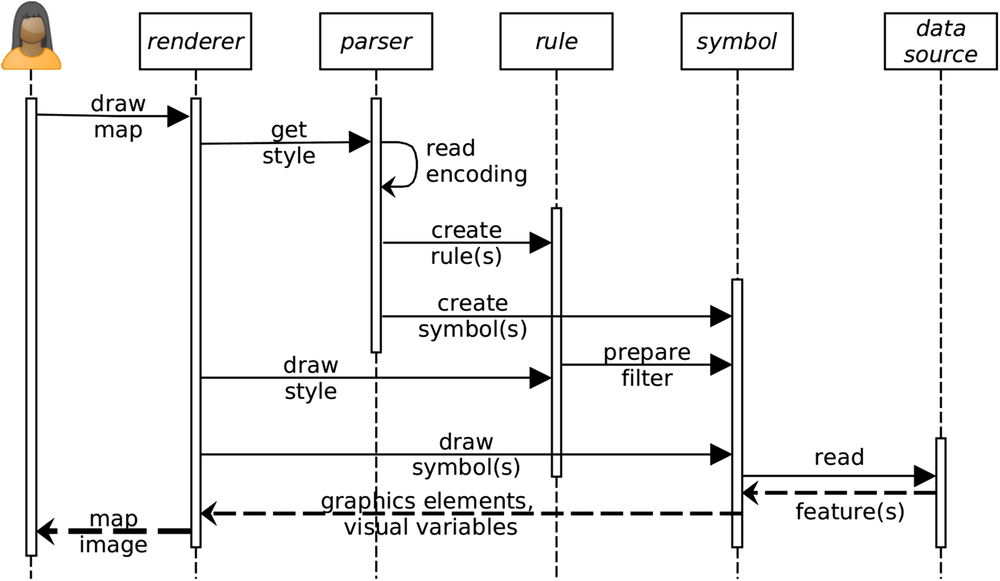
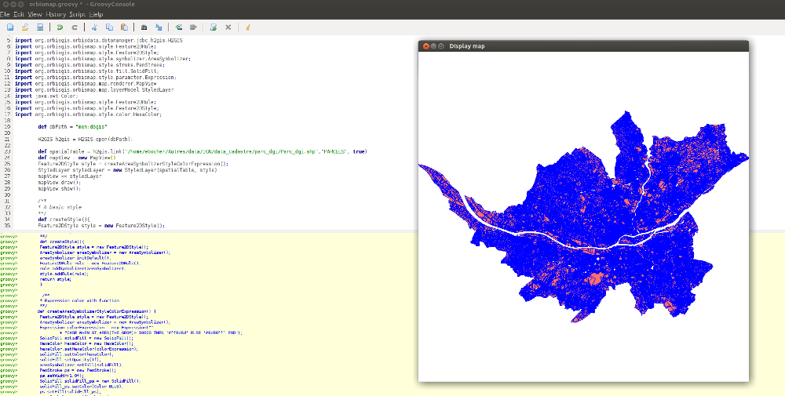

## Introduction


OrbisMap is a collection of tools to support the rendering of geospatial information using the [Java2D API](https://docs.oracle.com/javase/8/docs/technotes/guides/2d/spec/j2d-intro.html).

OrbisMap is a organized in modules.


- Symcore : API that implements the [SymCore](symcore.md) specification
- [Feature2DStyle ](./conceptual_model/feature2dstyle.md): A style extensions for 2D geometry features
- Feature2DStyle-io :  Methods to read and write a Feature2DStyle in XML or JSON file
- Map-api : API to define the Layer model used by the renderer
- Map : Renderer implementation


OrbisMap is under active development. Its architecture is not yet stabilized and changes according to the adaptations that are done on the style extensions.

OrbisMap is distributed under the LGPL 3 license.

See the [GitHub](https://github.com/orbisgis/orbismap)  repository to get involved, submit patches or issues.


## Rendering engine


The Map module contains the mechanism to parse style and draw it. It is divided into 12 sequences.

- (1) User interface event to draw a map.
- (2) The renderer engine gets the style file that contains the symbology instructions.
- (3, 4 and 5) The style file is read by the Feature2DStyle-io parsers to create the Java Style Object Model composed of rules and symbols.
- (6) The renderer engine starts to draw the style object looping over each rules.
- (7) Each rule is scanned to check if a filter must be applied. The filter  condition (e.g., select all values greater than…) is prepared for each  symbolizer of the rule. 
- (8) The renderer engine starts to draw all symbols available in the Java Style Object Model.
- (9) Each symbol reads the data source on which the style must be applied.
- (10) A set of features according to the potential filter constraint of the  symbolizer is returned (including geometries and data attributes).
- (11) The symbols are filled with the features properties to create the graphic elements and visual variables.
- (12) Finally, the renderer engine displays the style as a map image.




<center>Figure 14: Main sequences of the rendering engine.</center>


It's important to note that the input data model used by the render implementation is based on the ISpatialTable interface provided by OrbisData library. This means that only the data organized in the table form (rows-columns) with a SFS-2 geometry model is supported, a.k.a : 2D feature vector data.  

A feature is described as an abstraction of real world  phenomena as defined by GML standard ([Portele, 2007](http://www.opengeospatial.org/standards/gml)).


## How to use it

The OrbisMap rendering engine is called MapView. The MapView contains methods to control a layer model and draw it.  A layer model is collection of layers. The layer model may contain zero or several layers.  A layer offers different functionality and rendering characteristics that depend on the data displayed. 

To render a Feature2DStyle you must initialize a StyledLayer which is a ISpatialTable plus a  Feature2DStyle.

The following example illustrates how to use MapView from a Groovy Console. It shows how to create a style and display it in a frame.


```groovy
@GrabResolver(name='orbisgis', root='https://nexus.orbisgis.org/repository/orbisgis/')
@Grab(group='org.orbisgis.orbismap', module='map', version='0.0.1-SNAPSHOT')


import org.orbisgis.orbisdata.datamanager.jdbc.h2gis.H2GIS
import org.orbisgis.orbismap.style.Feature2DRule;
import org.orbisgis.orbismap.style.Feature2DStyle;
import org.orbisgis.orbismap.style.symbolizer.AreaSymbolizer;
import org.orbisgis.orbismap.style.stroke.PenStroke;
import org.orbisgis.orbismap.style.fill.SolidFill;
import org.orbisgis.orbismap.style.parameter.Expression;
import org.orbisgis.orbismap.map.renderer.MapView
import org.orbisgis.orbismap.map.layerModel.StyledLayer
import java.awt.Color;
import org.orbisgis.orbismap.style.Feature2DRule;
import org.orbisgis.orbismap.style.Feature2DStyle;
import org.orbisgis.orbismap.style.color.HexaColor;

        //Load an H2GIS database in memory 
        def dbPath = "mem:dbgis"
        H2GIS h2gis = H2GIS.open(dbPath);
		//Link a shapefile to the database
        def spatialTable = h2gis.link("polygons.shp","mydata", true)
        //Initialize the MapView component
        def mapView = new MapView()
        //Create a feature style
        Feature2DStyle style = createAreaSymbolizerStyleColorExpression();
        //Link the style with the data in a StyledLayer object
        StyledLayer styledLayer = new StyledLayer(spatialTable, style)
        //Add the style to the MapView
        mapView << styledLayer
        //Draw and show it in a JFrame
        mapView.draw();
        mapView.show();
        
                
        /**
        * Create an AreaSymbolizer style with a
        * color expression
        **/
       def createAreaSymbolizerStyleColorExpression() {
        Feature2DStyle style = new Feature2DStyle();
        AreaSymbolizer areaSymbolizer = new AreaSymbolizer();
        Expression colorExpression = new Expression(""
                + "CASE WHEN ST_AREA(THE_GEOM)> 10000 THEN '#ff6d6d' ELSE '#6d86ff' END");
        SolidFill solidFill = new SolidFill();
        HexaColor hexaColor = new HexaColor();
        hexaColor.setHexaColor(colorExpression);
        solidFill.setColor(hexaColor);
        solidFill.setOpacity(1f);
        areaSymbolizer.setFill(solidFill);
        PenStroke ps = new PenStroke();
        ps.setWidth(1.0f);
        SolidFill solidFill_ps = new SolidFill();
        solidFill_ps.setColor(Color.BLUE);                
        ps.setFill(solidFill_ps);
        areaSymbolizer.setStroke(ps);
        Feature2DRule rule = new Feature2DRule();
        rule.addSymbolizer(areaSymbolizer);
        style.addRule(rule);
        return style
    }
```

Result : 


