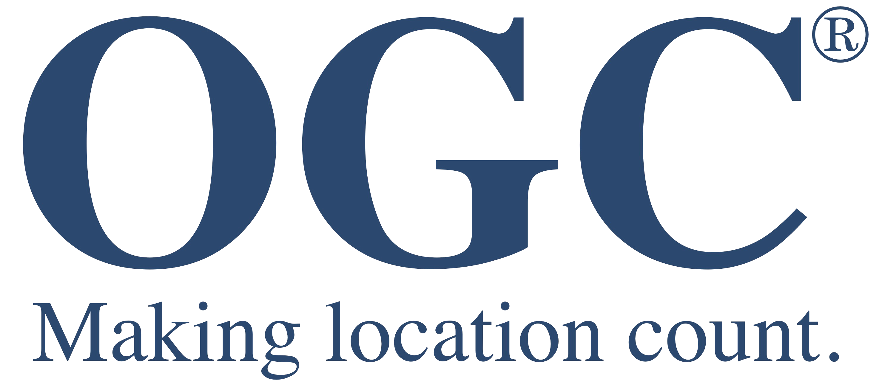

## Introduction

Despite most [Spatial Data Infrastructures](http://gsdiassociation.org/index.php/publications/sdi-cookbooks.html) offering 
service-based visualization of geospatial data, requirements are often at a very basic level leading to poor quality of maps. 
This is a general observation for any geospatial architecture as soon as open standards as those of the Open Geospatial Consortium ([OGC](https://www.ogc.org/)) 
are applied. 
To improve the situation, the [Media Engineering Institute](https://heig-vd.ch/rad/instituts/mei) and the LAB-STICC - [CNRS](https://www.cnrs.fr) 
focused on improvements at the portrayal interoperability side by considering standardization aspects. 

We propose two major redesign recommendations. 

- First to consolidate the cartographic theory at the core of the OGC [Symbology Encoding standard](https://www.ogc.org/standards/se). 
- Secondly to build the standard in a modular way so as to be ready to be extended with upcoming future cartographic requirements. 

Thus, we start by defining portrayal interoperability by means of typical-use cases that frame the concept of sharing cartography 
(Ertz, Julien & Bocher, 2012; Ertz, 2013). Then we bring to light the strengths and limits of the relevant 
open standards to consider in this context (Sae-Tang A, Ertz O. 2007 ; Bocher et al, 2012). 
Finally we propose a set of recommendations to overcome the limits so as to make these use cases a true reality. 
Even if the definition of a cartographic-oriented standard is not able to act as a complete cartographic design framework by itself, 
we argue that pushing forward the standardization work dedicated to cartography is a way to share and disseminate good practices and finally 
to improve the quality of the visualizations (Bocher et al, 2011, Bocher & Ertz, 2015; 2018).

This research work on the standardization of cartographic representations has been discussed since 2010 in the Standard Working Group
[Styled Layer Descriptor and Symbology Encoding](https://www.ogc.org/projects/groups/sldse1.2swg).

In October 2019, the SWG group proposed a new abstract, conceptual and modular specification called **SymCore**.

You can follow the progress of the standard here https://www.ogc.org/roadmap

Since May 2019, a new domain working group dedicated to portrayal of geospatial information has been created.
[Portrayal DWG](https://www.ogc.org/projects/groups/portrayaldwg) focus on standardization of portrayal rules, registry data, styles, and encoding formats.

_References_

Bocher E, Ertz O. 2018. A redesign of OGC Symbology Encoding standard for sharing cartography. PeerJ Computer Science 4:e143 https://doi.org/10.7717/peerj-cs.143 

Bocher E, Petit G, Gueganno A, Fortin N, Gourlay A, Ertz O. 2012. Séminaire de restitution du SOGVILLE (Système d’Observation Géographique de la Ville).

Bocher E, Ertz O. 2015. Towards Cartographic Portrayal Interoperability – the Revision of OGC Symbology Encoding Standard. 
In: Proceedings of the 1st ICA European Symposium on Cartography. Vienne, Austria, 116–119.

Bocher E, Ertz O, Laurent M, Hégron G, Petit G, Rappo D. 2011. Cartographie et standard : du modèle a l’utilisateur. 
In: Proceedings of the 25th International Cartographic Conference Paris, 3-8 July 2011. Paris: ICC.

Ertz O, Julien LG, Bocher E. 2012. Collaborative authoring and polypublication of cartographic content. 
In: OGRS2012 Symposium Proceedings. Yverdon Les Bains: lulu.com.

Ertz O. 2013. Feasibility study about Swiss geological symbols using the system-independent OGC SLD/SE standards.

Sae-Tang A, Ertz O. 2007. Towards Web Services Dedicated to Thematic Mapping. OSGeo Journal. OSGeo Journal 3:30–34.

## Symbology conceptual core standard (SymCore)

  

The SWG work that led to SymCore proposal has been done in the continuation of the [Symbology Encoding standard](https://www.ogc.org/standards/se) (SE 1.1). 
While ​portrayal ​concerns the complete picture of what can be called a“cartographic ecosystem”, the description of ​
symbology ​rules rather concerns the subpart of it about the instructions to be applied by a rendering engine 
to symbolize geodata. That’s why this proposal has a focus on symbology versus concerns close to [Web Map Service](https://www.ogc.org/standards/wms) (WMS) 
[Style Layer Descriptor profile](https://www.ogc.org/standards/sld) (SLD) considerations. In other words, while a set of “layer ​style​” describe the links 
between some geodata and some styles to build a map, each of these styles are built of a set of symbology rules 
in accordance with SymCore.The overall motivation that lead to this proposal is related to 
the issue “​how to make richer the symbology abilities​”. 

**The first** answer is modularity which comes with extensibility. SE 1.1 is not modular per se, while this proposal 
is designed to be so with a core model extensible to host the diversity of such abilities in relation to various data models. 
It means that the core model is somewhat abstract and does not define concrete visualisations 
(e.g. red dashed line of wide thickness to draw features of type cable car).

**The second** answer that follows from the first is about extensions. As soon as the conceptual basis is set out in a 
specification document (this proposal), then extensions have to document the concrete symbology concepts to portray 
geodata structured according to a given data model. It is worth to notice that conceptually the core model is not related 
to any specific underlying data model to represent. It is up to an extension to define styling abilities in relation to 
a specific data model(e.g 2DFeatureTypeStyle).

**Third** answer is about encodings. As soon as the conceptual basis is set out, extensions packaged,then it is to define 
encodings to format the concrete conceptual symbology abilities.

In summary, SymCore concerns the first answer with a consistent approach to:

   - provide the flexibility required to achieve adequate symbology rules for a variety ofinformation communities; 
    e.g. aviation symbols, weather symbols, thematic maps, etc, and;
   - achieve a high level styling interoperability without encoding dependencies. 
    
As a consequence, SymCore follows the same motivation that split up SLD 1.0 (SLD 1.1 andSE 1.1). It is to put 
together parts that are not specific to any service (e.g. WMS), that is to be independent, and to allow the concepts 
to be reused by other standards willing to address aspects related to cartography. 
So a more general and portable symbology model is proposed for use across the broad OGC standards baseline, to be applied 
to geospatial datasets as well as online geospatial data and mapping services.
 
 Potential implementations of SymCore are expected to enhance OGC standards such as the [Web Map Service](https://www.ogc.org/standards/wms), 
 [Web Feature Service](https://www.ogc.org/standards/wfs), [GeoPackage](https://www.ogc.org/standards/geopackage), and others. By sharing a common core, and using an extension mechanism, integration of 
 these standards for the purposes of cartographic representation could be greatly simplified.
 
 Check the SymCore document [here](https://portal.opengeospatial.org/files/89616)
 
 > Olivier Ertz, [Media Engineering Institute](https://heig-vd.ch/rad/instituts/mei) and Erwan Bocher, LAB-STICC - [CNRS](https://www.cnrs.fr), october 2019